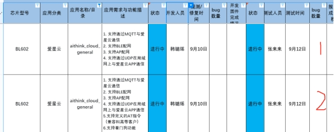
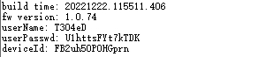

1、测试使用app为爱星云公版app，三元组也对应写入公版账号产品下的

（注：配网mqtt部分与卓工中间件上aithing_cloud_soc_mcu的demo一致的）

2、烧录三元组可用AT下方对应指令烧录

3、进入配网模式可用下方对应指令

4、本次测试对应为这两栏，提供的demo为2的，测试1也用此demo，因为2的功能是在1完成的基础上又叠加了两项。

 

5、AT指令说明

### ***\*AT\****

| AT                  |                                |
| ------------------- | ------------------------------ |
| 描述                | 测试 AT 框架是否正常工作的指令 |
| 响应                | OK  AT指令测试成功             |
| ERR  AT指令测试失败 |                                |
| 示例                | 发送：AT       响应：OK        |

 

### ***\*AT+KEY\****

| AT+KEY=设备id,用户名,密码 |                                                              |
| ------------------------- | ------------------------------------------------------------ |
| 描述                      | 通过AT指令向模组flash写入三元组数据                          |
| 响应                      | OK  三元组数据写入成功                                       |
| ERR  三元组写入失败       |                                                              |
| 示例                      | 发送：AT+KEY=HeeaUopCefFlrg,5VAVPl,HsasNdFZzTP10w         响应：OK |

 

### ***\*AT+RESTORE\****

| AT+RESTORE          |                                                      |
| ------------------- | ---------------------------------------------------- |
| 描述                | 将模组恢复出厂设置，让模组复位重启并进入配网模式     |
| 响应                | OK  AT指令处理成功                                   |
| ERR  AT指令处理失败 |                                                      |
| 示例                | 发送：AT+RESTORE                            响应：OK |

 

### ***\*AT+GDLT\****

| AT+GDLT             |                                                              |
| ------------------- | ------------------------------------------------------------ |
| 描述                | 获取模组启动的时间点。即模组上电启动后，等待上线成功后，模组便会将此次上线的时间记录在flash上，该时间点便记录模组首次启动后的时间点（若是因网络等其他原因离线又重新上线，模组并不会更新该时间点）。若是模组重新上电启动后，重新上线后，将会更新该时间点；若是模组重新启动后，未上线时，该时间点并未更新。 |
| 响应                | OK  AT指令处理成功                                           |
| ERR  AT指令处理失败 |                                                              |
| 示例                | 发送：AT+GDLT                              响应： |

 

### ***\*AT+RST\****

| AT+RST              |                                                   |
| ------------------- | ------------------------------------------------- |
| 描述                | 将模组进行复位重启                                |
| 响应                | OK  AT指令处理成功                                |
| ERR  AT指令处理失败 |                                                   |
| 示例                | 发送：AT+RST                             响应：OK |

 

### ***\*AT+GMR\****

| AT+GMR              |                                                              |
| ------------------- | ------------------------------------------------------------ |
| 描述                | 获取模组固件信息                                             |
| 响应                | OK  AT指令处理成功                                           |
| ERR  AT指令处理失败 |                                                              |
| 示例                | 发送：AT+GMR                                               响应： |

 

### ***\*AT+UARTCFG\****

| AT+UARTCFG=波特率   |                                                              |
| ------------------- | ------------------------------------------------------------ |
| 描述                | 设置模组uart0通信的波特率。通过该AT指令设置波特率后，需将模组复位后方可生效。 |
| 响应                | OK  AT指令处理成功                                           |
| ERR  AT指令处理失败 |                                                              |
| 示例                | 发送：AT+UARTCFG=115200              响应：OK                |

 

### ***\*AT+CIPSTAMAC\****

| AT+CIPSTAMAC?       |                                                              |
| ------------------- | ------------------------------------------------------------ |
| 描述                | 获取模组的MAC地址                                            |
| 响应                | OK  AT指令处理成功                                           |
| ERR  AT指令处理失败 |                                                              |
| 示例                | 发送：AT+CIPSTAMAC?                             响应： |

 

***\*AT+NodeMCUTEST\****

| AT+NodeMCUTEST=<start> |                                                              |
| ---------------------- | ------------------------------------------------------------ |
| 描述                   | 开发板测试使能当开发板测试使能开启后，如果按键触发就会在串口打印\r\n##boot\r\n当开发板测试使能关闭后，按键触发也不会打印上述字符（按键触发在bl602底板上对应按键RURN按下） |
| 参数                   | start： 0：关闭 1：开启                                      |
| 响应                   | OK  AT指令处理成功                                           |
| ERR  AT指令处理失败    |                                                              |
| 示例                   | 发送：AT+NodeMCUTEST=1                响应：OK               |

 

 

 

***\*AT+LEDTEST\**** 

| AT+LEDTEST=<start>  |                                                              |
| ------------------- | ------------------------------------------------------------ |
| 描述                | 测试开发板LED                                                |
| 参数                | start： 0：关闭跑马灯 1：开始跑马灯（蓝、红、绿切换，每个亮 1000ms） |
| 响应                | OK  AT指令处理成功                                           |
| ERR  AT指令处理失败 |                                                              |
| 示例                | 发送：AT+LEDTEST=1                   响应：OK并且跑马灯开始  |

 
