# Ai-Think Cloud XXJ

### 一、功能描述

​		小安派-爱星物联香薰机屏幕控制进入配网模式，配网成功后支持触摸屏控制和app控制两种控制方式，可以控制喷雾开关、调节三个档位与四个模式；同时可通过app设置定时开关、倒计时开关。

1支持按键功能

#### 1、按键功能

- 长按3s设备开机/关机

#### 2、LED状态显示功能

- 设备开机：灯长亮
- 设备关机：灯长灭

- 设备已进入配网状态：灯闪烁
- 配网成功：灯长亮

#### 3、app控制功能

* 控制喷雾开关
* 控制喷雾档位
* 控制喷雾模式
* 设置定时开启/关闭喷雾
* 设置倒计时开启/关闭喷雾

#### 4、触摸屏控制功能

* 控制设备进入配网模式
* 控制喷雾开关
* 控制喷雾档位
* 控制喷雾模式
* 首页显示时间、日期

### 二、编译

#### 1、menuconfig配置

* menuconfig配置指令

  ```
   ./build.sh bl618 aithink_cloud_xxj menuconfig
  ```

* menuconfig功能配置

  * adt配置
    * 云端控制使能：adt -->Cloud config -->Aithing cloud -->wan network enable
    * 局域网控制使能： adt -->Cloud config -->Aithing cloud -->lan network enable
    * BLE配网使能: adt -->Cloud config -->Aithing cloud -->ble distribution network enable
    * AP配网使能：adt -->Cloud config -->Aithing cloud -->ap distribution network enable
    * ota使能：adt -->Cloud config -->Aithing cloud -->ota enable
  * application配置
    * LED GPIO配置：application-->led config
    * flash存储数据的起始地址配置(需根据不同分区表而配置，需注意不同平台以及不同flash大小上的分区表时，其起始地址是不同的)：application-->Data start address-->Flash rw start addr
    * flash 存储扇区大小配置：application-->Data start address-->flash region size
    * 芯片平台类型配置：application-->chip platform-->chip platform（此demo仅支持bl618）
    * 云端控制模块使能：application-->module config-->wan network enable
    * 局域网控制模块使能：application-->module config-->Lan network enable
    * BLE配网模块使能：application-->module config-->ble distribution network enable
    * AP配网模块使能：application-->module config-->ap distribution network enable
    * OTA模块使能：application-->module config-->ota module enable

#### 2、编译指令

```
 ./build.sh bl618 aithink_cloud_xxj cn debug
```

#### 3、固件烧录

* [烧录工具下载链接](https://dev.bouffalolab.com/home)
* **注：分区表需根据实际情况调整地址，本demo分区表已提供（aithink_cloud_xxj-->partitioned_table下）**

### 三、使用

#### 1、供电

​	小安派-爱星云香薰机 采用Type-C 长供电方式，在机身的右侧，有Type-C 接口。

​                                                                 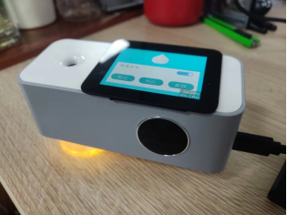 


#### 2、开关机

香薰机上电之后，长按开关3s开机/关机。

​                                                                           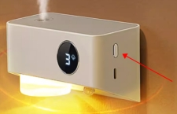 

#### 3、配网

- ​	香薰机需要连接网络才能配合爱星云做远程控制：

  -  在主界面往上滑动屏幕，进入菜单界面；

  -  选择配网；

  -  使用爱星云App 添加“带屏香薰机”；

  -  等待添加完成

​                                                        

- ​    app配网    

​		详细参考demo aithing_cloud_soc_mcu下readme中描述

​																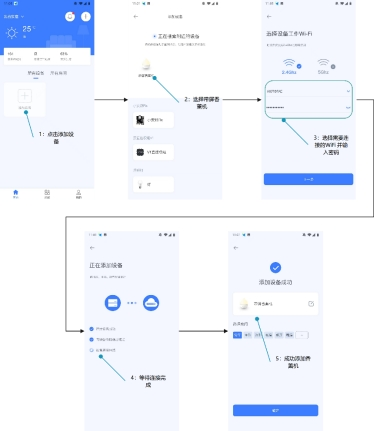 

#### 4、 **灯状态介绍**

| 序号 | 指示灯状态 | 功能       |
| ---- | ---------- | ---------- |
| 1    | 常亮       | 开机并联网 |
| 2    | 熄灭       | 关机       |
| 3    | 快闪       | 未联网     |
| 4    | 慢闪后常亮 | 成功联网   |

#### 5、喷雾开关

- 具有断电记忆功能

- 触摸屏开关

​		在菜单界面中，喷雾开关开启，喷雾会以当前档位设置开启喷雾，并按照当前模式设置运行。

​																	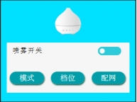

- app开关

​	App 控制界面的“开关” 在控制界面的最下方。

​																	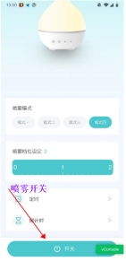 

#### 6、档位控制

- 档位介绍

  - 小雾

  - 中雾

  - 大雾

- 档位设置

  - 通过触摸屏设置

    点击触摸屏的菜单界面，”档位”按钮可进入档位设置界面，点击 “小雾”、“中雾”或“大雾”其中之一按钮即可设置档位：

    ​												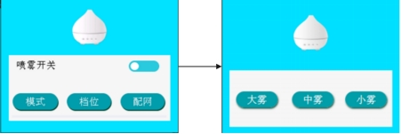

  - 通过app设置

     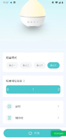

  

  

  

- ##### ***\*档位设置必须在喷雾开关开启时才能生效。\****

- 默认为小雾

- 具有断电记忆功能

#### 7、模式控制

- 模式介绍

  - 模式1：开启5s 停止20分钟

  - 模式2：开启5s 停止15分钟

  - 模式3：开启5s 停止10分钟

  - 模式4：开启5s 停止5分钟

- ***\*模式设置只有在喷雾开关开启时才能生效\****

- 默认为模式一

- 具有断电记忆功能

- 模式设置

  - 通过触摸屏设置

    在菜单界面选择点击“模式”按钮。即可进入模式设置界面，点击“模式1”、“模式2”、“模式3”或“模式4”其中之一按钮即可设置喷雾模式：

    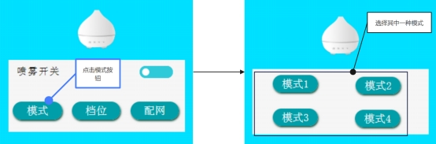 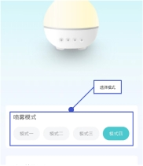

  - 通过app设置

​															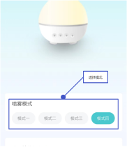

​	8、定时/倒计时开关喷雾

​																				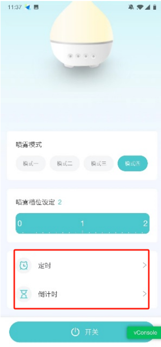


