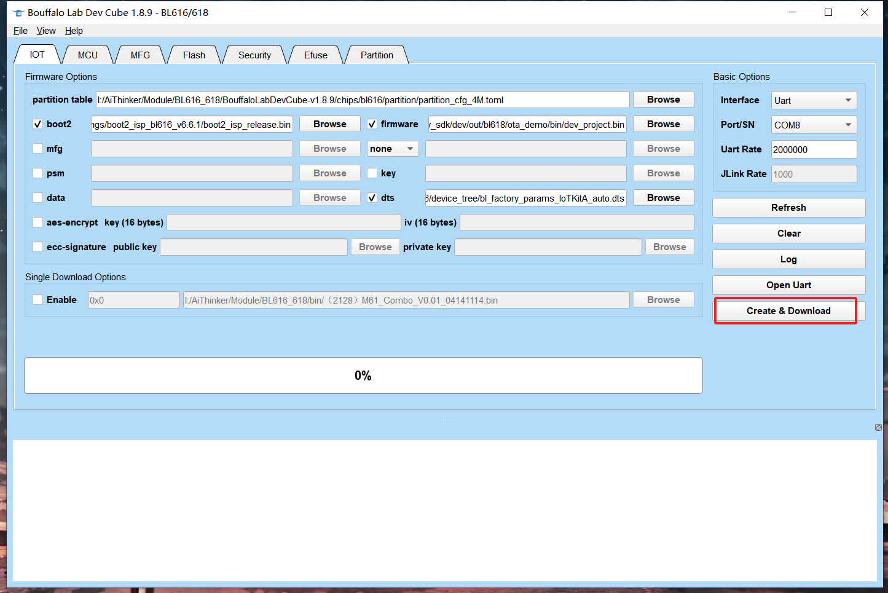
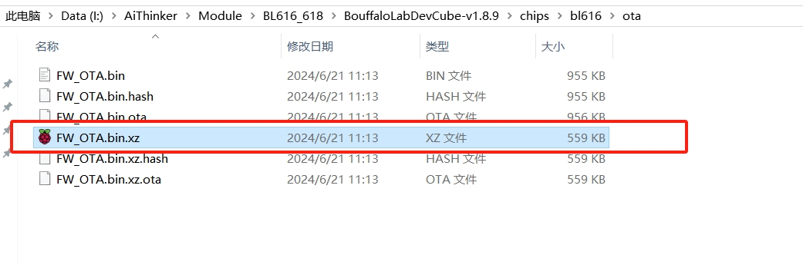
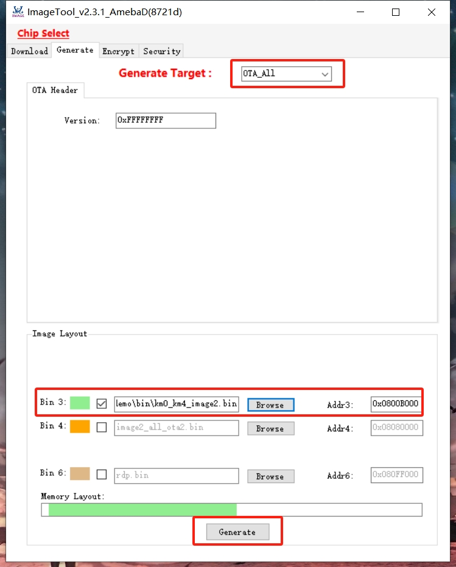
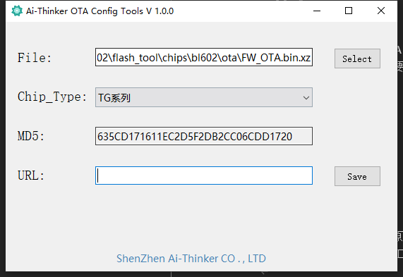
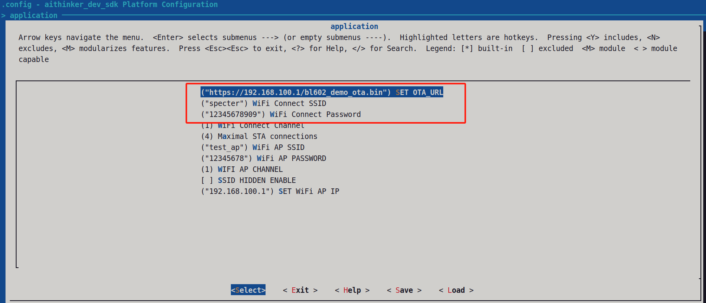

# 一、简介

本demo主要演示了如何进行模组OTA升级。

# 二、制作升级包

## 2.1 BL602/BL616/BL618模组制作升级包
在烧录工具中选择需要升级的固件，点击Create & Download按钮即可生成升级包。bl602升级包位于烧录工具目录下的chips/bl602/ota/FW_OTA.bin.xz，BL616和BL618升级包位于chips/bl616/ota/FW_OTA.bin.





## 2.2 rtl8720dx模组制作升级包

在烧录工具中如图所示制作升级包,用km0_km4_image2.bin来制作升级包。



## 2.3 升级包打包头部信息

打开Ai-Thinker OTA Config Tools.exe（位于doc文件夹内），选择上个步骤生成的升级包，按save生成OTA固件，将此固件上传到服务器，并记录固件的url。




# 三、编译

1. 进入sdk/dev目录

2. 在menuconfig中设wifi的ssid和password,设置模组ota升级包的url；

```c
   eg：./build.sh bl602 ota_demo menuconfig
```




3. 执行 ./build.sh <platform> ota_demo cn debug 开始编译

```c
   eg：./build.sh bl602 ota_demo cn debug
```

# 四. 测试

1. 烧录固件

2. 手动复位模组，波特率：921600。通过串口调试助手查看log信息，确认模组是否升级成功，升级成功后，log信息中会打印OTA Success，升级失败则打印OTA Fail。
