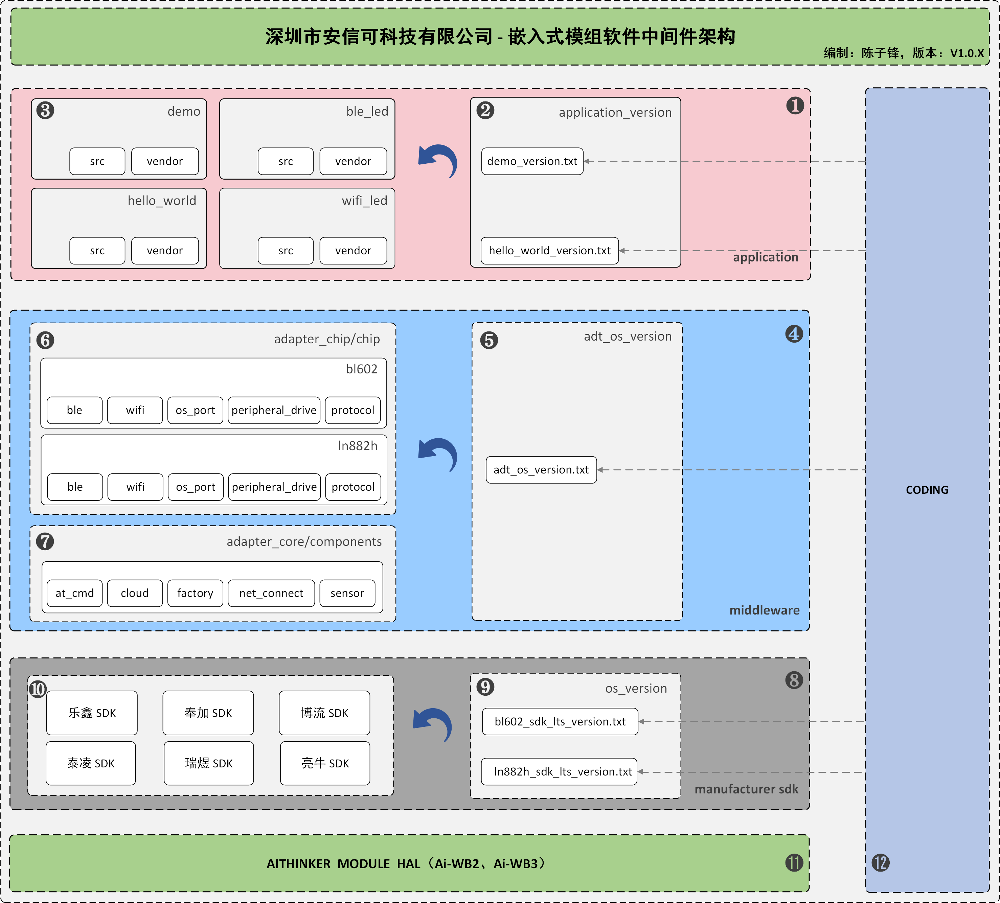

## 仓库介绍：


**深圳市安信可科技有限公司应用开发通用接口项目，通过对底层芯片接口进行抽象，实现应用开发接口统一**


## 仓库特点：


**接口统一，代码复用高，模块式开发**

**一次开发，跨平台运行，支持在不同的芯片平台运行同一套接口应用程序**

**一次熟悉，接口一致性，应用开发者/客户，仅需要熟悉一套接口开发，无需熟悉多个芯片平台接口，大大降低重复性工作**


## 仓库架构：





## 仓库说明：


| 编号 | 标题               | 详细用途                                                     |
| ---- | ------------------ | ------------------------------------------------------------ |
| 1    | 业务代码层         | 用于存放业务应用需求代码，例如灯/插座等  ；业务代码层通过调用中间层接口实现，不允许调用第三方接口 |
| 2    | 业务代码仓库管理器 | 用于关联CODING平台仓库，管理业务代码块，包括业务代码块的仓库名称、地址、分支、commit等 |
| 3    | 业务代码块项目仓库 | 每一个业务代码块都对应一个CODING仓库，单独提交和维护         |
| 4    | 中间件接口层       | 中间件负责屏蔽芯片厂商SDK的接口差异                          |
| 5    | 中间件仓库管理器   | 用于关联CODING平台仓库，管理中间件代码块，包括业务代码块的仓库名称、地址、分支、commit |
| 6    | 中间件适配层       | 类原子接口，射频、系统、外设、网络等；要求调用厂商接口实现，不允许调用第三方接口；不允许适配层之间接口相互调用 |
| 7    | 中间件核心层       | 核心层必须基于中间件适配层实现，是对适配层更高维度的封装实现，包括通用方法、协议、云平台对接、传感器驱动等 |
| 8    | 厂商原始代码       | 用于存放和长期维护厂商原始SDK                                |
| 9    | 厂商原始SDK管理器  | 用于关联CODING平台仓库，管理厂商原始SDK                      |
| 10   | 厂商原始SDK        | 存放具体芯片厂商原始SDK与长期维护补丁，不允许应用开发者直接调用其中的变量或函数（安信可内部） |
| 11   | 安信可硬件模组     | 首版已适配的模组型号包括Ai-WB2、Ai-WB3                       |
| 12   | 安信可仓库平台     | 安信可内部仓库管理平台，负责仓库的存储、权限管理             |


## 目录结构：

```
.
├── adt								//抽象层
│   ├── adt_kconfig
│   ├── adt_os						//接口层
│   ├── adt_os_version
│   ├── adt_os_version_ctrl.sh
│   └── adt_tools
├── application						//应用开发目录
│   ├── application_init.sh
│   ├── application_version
│   ├── application_version_ctrl.sh
│   ├── demo						//例程
│   └── hello_world					//例程
├── build							//构件规则目录
│   ├── bl602_make
│   ├── ln882h_make
│   ├── README.md
│   └── w800_make
├── build.sh
├── docs							//开发文档目录
│   ├── html
│   ├── image
│   ├── 中间件层文件命名规范.md
│   ├── 中间件层目录结构解析.md
│   ├── 代码规范.md
│   ├── 应用开发目录结构解析.md
│   ├── 应用开发者提交接口需求的方法.md
│   ├── 开发评审流程.md
│   ├── 提交代码到仓库.md
│   ├── 新建一个应用开发项目.md
│   └── 语法说明.md
├── LICENSE
├── os								//各个厂商软件
│   ├── bl602_sdk_lts
│   ├── esp8266_sdk_lts
│   ├── hi3861_sdk_lts
│   ├── ln882h_sdk_lts
│   ├── os_kconfig
│   ├── os_version
│   ├── os_version_ctrl.sh
│   ├── README.md
│   ├── rtl8720cf_sdk_lts
│   └── w800_sdk_lts
├── out								//固件生成目录
│   ├── bl602
│   └── ln882h
├── pre_commit.sh
├── README.md
├── test
│   └── test_report
├── thirds							//第三方库引用
├── tmp								
│   ├── kconfig
│   ├── kconfig_h
│   └── src
└── tools							//开发工具目录
    ├── af.sh
    ├── as.sh
    ├── astyle
    ├── clean.sh
    ├── doxygen
    ├── env_config.sh
    ├── formatting
    ├── platform_config
    └── update.sh

```


## 基础命令：

帮助命令：

```
$ ./build.sh help					//用于打印SDK工具支持的命令行

```

工具版本查询命令：

```
$ ./build.sh version				//查询工具版本编号

```

中间件接口文档更新命令：

```
$ ./build.sh docs					//更新中间接口文档

```

编译清空命令：

```
$ ./build.sh clean					//清空全部编译结果
$ ./build.sh 芯片型号 应用名称 clean   //清空具体应用结果

```

仓库恢复出厂命令：

```
$ ./build.sh reset					//清空所有改动，将仓库恢复到出厂模式

```

子仓库更新方法：

```
$ ./build.sh update					//一般在初始化SDK阶段使用，这个指令会更新/覆盖子仓库内容，如果对子仓库有更新未进行提交，不建议执行该指令

```

仓库环境部署命令：

```
$ ./build.sh environment			//自动下载编译依赖包，如发现依赖包不满足，请发送邮件到 <chenzf@aithinker.com>

```

应用开发配置方法：

```
$ ./build.sh 芯片型号 应用名称 menuconfig		 举例：./build.sh ln882h demo menuconfig
```

应用开发编译方法：

```
$ ./build.sh 芯片型号 应用名称 国家编码 调试等级	举例：./build.sh ln882h demo cn debug

```


## 迭代规划：

| 目标内容                                                     | 时间    |
| ------------------------------------------------------------ | ------- |
| 软件部内部适配，移植完成Combo-AT所有接口；适配常用外设接口；仅软件部使用 | 2-4月份 |
| 软件和技术支持，应用于定制项目；对公司外部不开放             | 4-6月份 |
| 提供英文版支持，开源版本； GitHub 和 码云同步开放            | 6-7月份 |
| 适配不带操作系统平台应用；                                   | 7-9月份 |

## 商业价值：

| 开发模型：                                          |
| --------------------------------------------------- |
| [传统软件开发模型](./docs/传统软件开发模型.md).     |
| [中间件平台开发模型](./docs/中间件平台开发模型.md). |

## 指导文档：

| 通用参考：                                                   |
| ------------------------------------------------------------ |
| [代码规范](./docs/代码规范.md).                              |
| [语法说明](./docs/语法说明.md).                              |
| [GIT指令使用方法](./docs/learn_file/GIT指令使用方法.pdf).    |
| [开发者提交代码到Coding仓库的方法](./docs/提交代码到仓库.md). |

| 应用开发：                                                   |
| ------------------------------------------------------------ |
| [应用开发目录结构解析](./docs/应用开发目录结构解析.md).      |
| [新建一个应用开发项目](./docs/新建一个应用开发项目.md).      |
| [接口不能完全满足项目需求，应用开发者提交接口需求的方法](./docs/应用开发者提交接口需求的方法). |

| 中间件层：                                              |
| ------------------------------------------------------- |
| [中间件层目录结构解析](./docs/中间件层目录结构解析.md). |
| [中间件层文件命名规范](./docs/中间件层文件命名规范.md). |

| 系统适配：                                                   |
| ------------------------------------------------------------ |
| [在OS目录下新增一个平台SDK的方法](./os/在OS目录下新增一个平台SDK的方法.md). |

| 评审规则：                              |
| --------------------------------------- |
| [开发评审流程](./docs/开发评审流程.md). |


